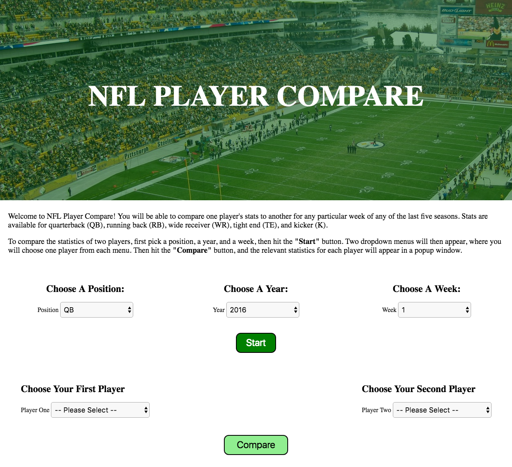
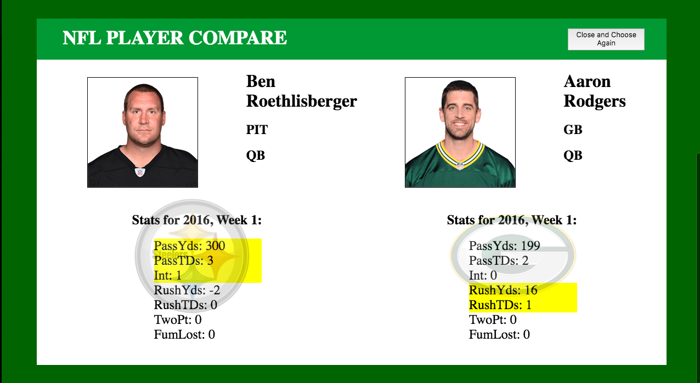

## Application:

http://player-compare.herokuapp.com/index.html

NFL Player Compare compares two NFL players at a particular position based on relevant statistics.  Players' statistics are displayed for a single week in a single season.  The user inputs the position, the season (year), and the week for comparison.  Based on that information, the call to the API listed below is made and two identical dropdown menus are displayed from which the user selects two players.  Once the players are selected, the relevant statistics are displayed along with a comparison denoted by yellow highlighting.  The user can then close the popup window and choose another set of players from the same position-year-week set of choices, or choose a new set of position, year, and week criteria.

## Code:

NFL Player Compare is the 1st Capstone Project for Thinkful's Full-Stack Web Development Course.  It encompasses HTML, CSS, JavaScript, jQuery, AJAX, and call(s) to an API.

This application makes use of jQuery for display functionality and jQuery's AJAX function to call the API.  Layout for both the main page and the popup window is done with the CSS-Grid property.

## API Reference:

NFL.com Fantasy Football Web Services Documentation - Version 1  -  http://api.fantasy.nfl.com/v1/docs

Specifically, the API url endpoint used to retrieve player information is: http://api.fantasy.nfl.com/v1/players/scoringleaders

## Note of Caution - Important!!!

1.  As of May 21st, 2017, the NFL API site used for this application is undergoing an update.  As a result, the player statistics from any year prior to 2016 returns all false values, which are rendered as "0" in this app.  The player name, team, and position, along with the player photo and his team's logo are still rendered for all possible years.  Correct statistics from years other than 2016 had been rendered prior to this update, and hopefully will again.

## Screenshots:
First Page:

Popup Window:

